# 检测室数据分析系统 - 使用说明书

> 版本：v1.0  
> 最后更新：2026-04-07

---

## 目录

1. [系统概述](#一系统概述)
2. [登录与首页](#二登录与首页)
3. [基础管理](#三基础管理)
   - 3.1 [产品规格定义](#31-产品规格定义)
   - 3.2 [单位管理](#32-单位管理)
   - 3.3 [特性等级管理](#33-特性等级管理)
   - 3.4 [外观特性大类管理](#34-外观特性大类管理)
   - 3.5 [外观特性管理](#35-外观特性管理)
   - 3.6 [公共维度管理](#36-公共维度管理)
   - 3.7 [公式维护](#37-公式维护)
   - 3.8 [判定等级](#38-判定等级)
   - 3.9 [指标列表](#39-指标列表)
4. [数据管理](#四数据管理)
   - 4.1 [原始数据管理](#41-原始数据管理)
   - 4.2 [中间数据管理](#42-中间数据管理)
   - 4.3 [磁性数据导入](#43-磁性数据导入)
5. [报表与分析](#五报表与分析)
   - 5.1 [生产驾驶舱](#51-生产驾驶舱)
   - 5.2 [月度质量报表](#52-月度质量报表)
6. [常见问题](#六常见问题)

---

## 一、系统概述

检测室数据分析系统（Laboratory Data Analysis System）是一款面向实验室检测数据管理的综合平台，主要功能包括：

- **基础数据管理**：产品规格、单位、特性等级、外观特性等基础数据维护
- **数据导入与处理**：支持原始数据、中间数据、磁性数据的导入和管理
- **智能计算与判定**：基于公式配置自动计算检测指标，智能判定质量等级
- **数据分析与报表**：生产驾驶舱可视化展示、月度质量报表统计分析
- **AI辅助功能**：外观特性语义匹配、智能推荐等

### 系统界面概览

系统采用左侧导航菜单 + 右侧内容区的经典布局：

- **顶部栏**：显示系统名称、用户信息、消息通知
- **左侧菜单**：功能模块导航，支持展开/收起
- **内容区**：各功能模块的具体操作界面
- **页签栏**：支持多页签切换，方便并行操作

---

## 二、登录与首页

### 2.1 登录系统

1. 打开浏览器，访问系统地址
2. 输入账号和密码
3. 点击【登录】按钮进入系统

### 2.2 生产驾驶舱（首页）

登录后默认进入【生产驾驶舱】页面，这是系统的数据可视化首页，包含：

- **KPI指标卡**：合格率、总产量、叠片系数等关键指标
- **叠片系数趋势图**：展示指定日期范围内的叠片系数变化趋势
- **质量分布饼图**：合格/不合格品占比分布
- **班次对比雷达图**：各班次质量指标对比
- **不合格原因Top5**：主要不合格原因分析
- **厚度相关性散点图**：厚度与叠片系数相关性分析

**操作说明**：
- 使用右上角日期选择器切换统计日期范围
- 点击【刷新】按钮更新数据
- 鼠标悬停图表查看详细数据

---

## 三、基础管理

基础管理模块用于维护系统运行所需的基础数据，是整个系统的数据基石。

### 3.1 产品规格定义

**功能说明**：管理产品规格信息，包括产品编码、名称、检测列数配置以及扩展属性。

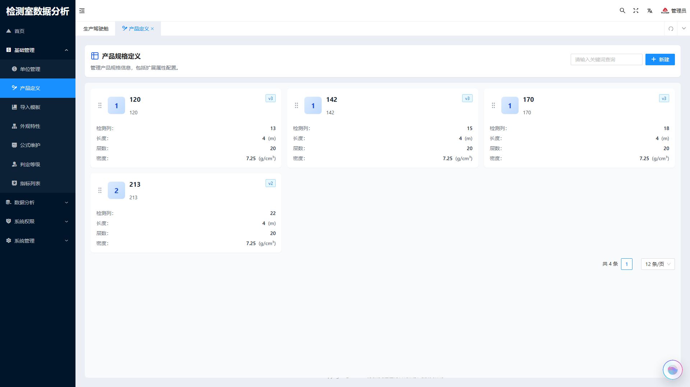

**操作步骤**：

1. 进入【基础管理】→【产品规格定义】

2. **新增产品规格**：
   - 点击【新增】按钮
   
   
   
   - 填写产品编码（必填，唯一标识）
   - 填写产品名称（必填）
   - 设置检测列数（决定该产品规格下检测数据的列数，默认15列）
   - 添加扩展属性（可选）：点击【添加属性】，设置属性名、属性值、单位
   - 点击【确定】保存

3. **编辑产品规格**：
   - 在卡片列表中找到目标产品
   - 点击卡片右上角的【编辑】链接
   - 修改相关信息后保存

4. **删除产品规格**：
   - 点击卡片右上角的【删除】链接
   - 确认删除操作（注意：删除后不可恢复）

5. **排序调整**：
   - 拖动卡片左侧的拖拽图标可调整排序
   - 排序变更会自动保存

**注意事项**：
- 产品编码必须唯一，不能重复
- 检测列数影响数据导入时的列数解析
- 版本标签显示当前生效的版本号

---

### 3.2 单位管理

**功能说明**：管理物理单位维度及单位定义，支持单位换算和标准化。

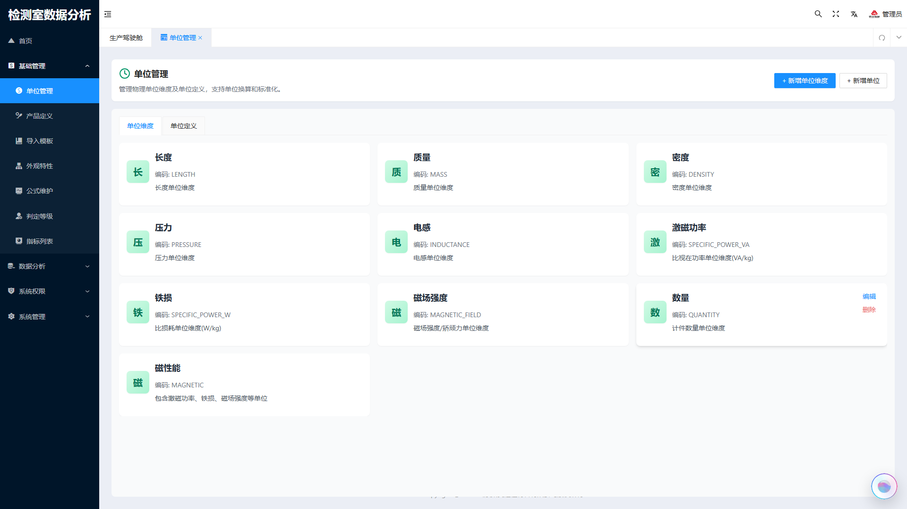

**界面说明**：
- 单位维度：定义物理量的类别，如长度、重量、时间等
- 单位定义：具体的计量单位，如毫米(mm)、千克(kg)等

**操作步骤**：

1. 进入【基础管理】→【单位管理】

2. **新增单位维度**：
   - 点击【新增单位维度】按钮
   
   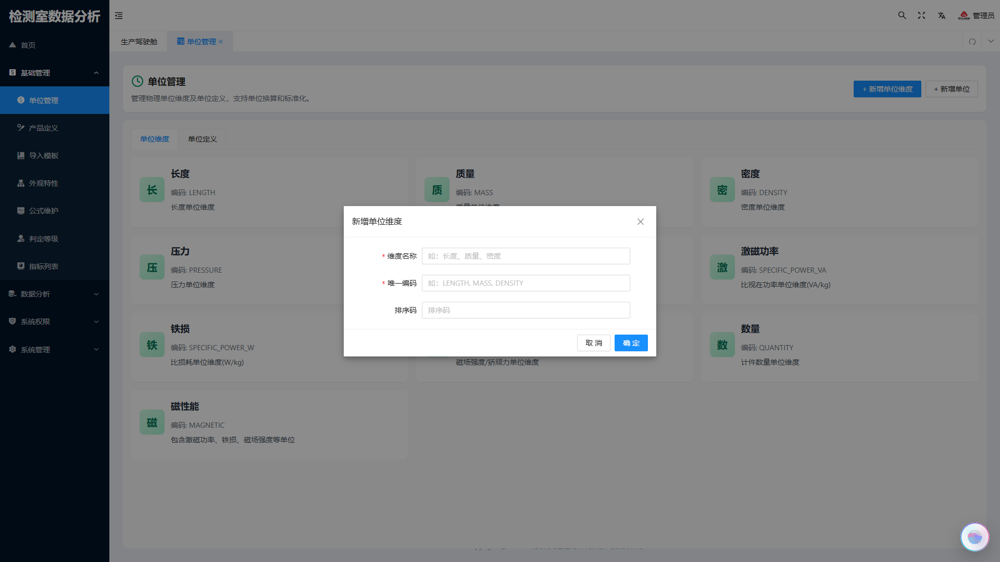
   
   - 填写维度名称（如"长度"、"重量"）
   - 填写维度编码（英文标识）
   - 填写描述信息（可选）
   - 点击【确定】保存

3. **新增单位**：
   - 切换到"单位定义"标签页
   
   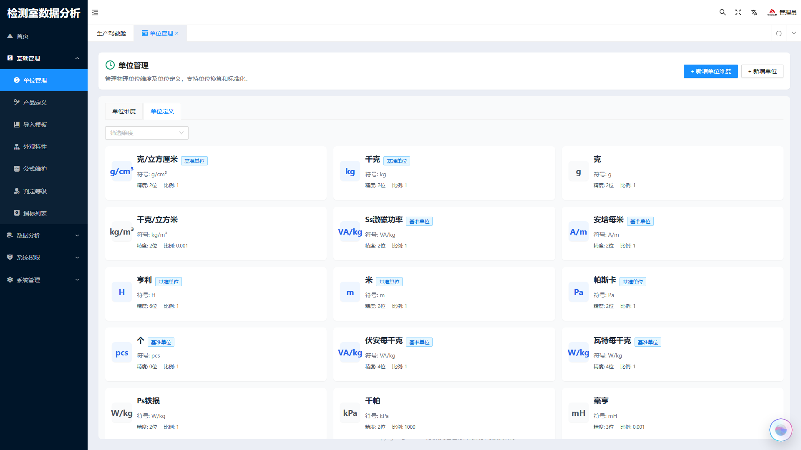
   
   - 点击【新增单位】按钮
   
   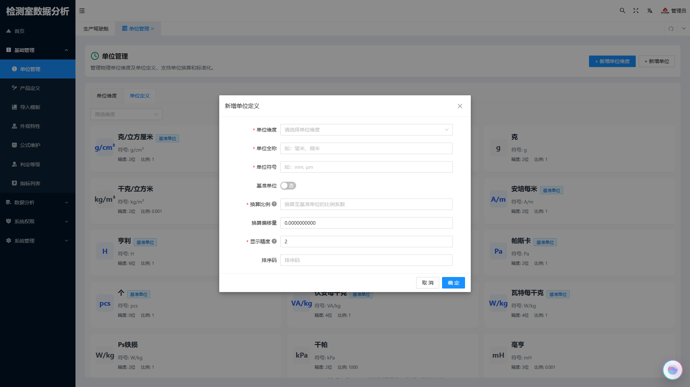
   
   - 选择所属维度
   - 填写单位名称（如"毫米"）
   - 填写单位符号（如"mm"）
   - 设置精度（小数位数）
   - 设置与基准单位的换算比例
   - 如需设为基准单位，勾选"基准单位"选项
   - 点击【确定】保存

**注意事项**：
- 每个维度必须有且只有一个基准单位
- 基准单位不能删除
- 换算比例是基于基准单位的倍数关系

---

### 3.3 特性等级管理

**功能说明**：维护外观特性的等级定义，用于AI匹配和特征分类。

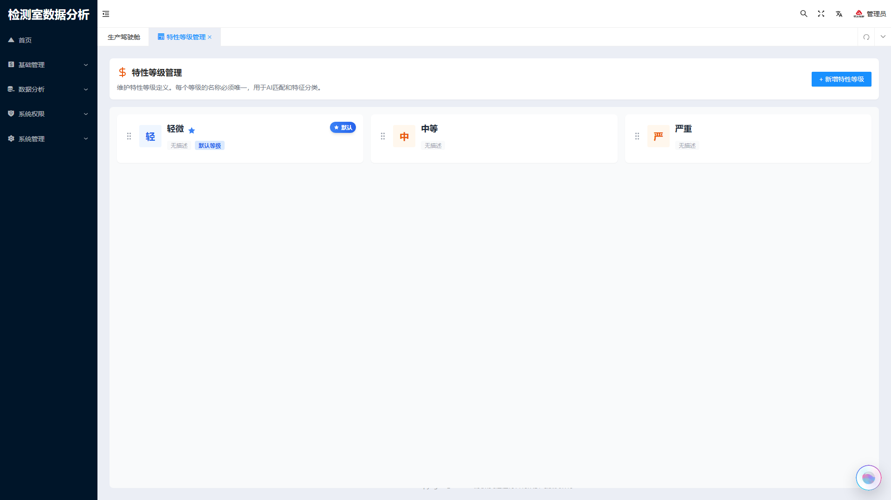

**操作步骤**：

1. 进入【基础管理】→【特性等级管理】

2. **新增等级**：
   - 点击【新增特性等级】按钮
   
   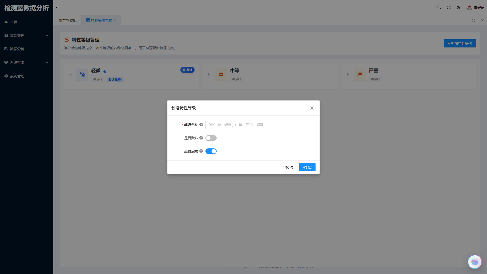
   
   - 填写等级名称（必填，必须唯一）
   - 填写描述信息（可选）
   - 设置是否启用
   - 设置是否为默认等级
   - 点击【确定】保存

3. **编辑等级**：
   - 找到目标等级卡片
   - 点击【编辑】按钮修改信息

4. **删除等级**：
   - 点击【删除】按钮
   - 确认删除操作

5. **排序调整**：
   - 拖动卡片左侧拖拽图标调整顺序

**注意事项**：
- 等级名称必须唯一
- 只能有一个默认等级
- 默认等级在AI匹配时作为优先匹配目标

---

### 3.4 外观特性大类管理

**功能说明**：管理外观特性的大类分类，支持多级分类结构。

**操作步骤**：

1. 进入【基础管理】→【外观特性大类管理】

2. **新增大类**：
   - 点击【新增大类】按钮
   
   
   
   - 填写大类名称
   - 选择父级分类（如不选择则为顶级分类）
   - 填写描述信息
   - 点击【确定】保存

3. **编辑大类**：
   - 在表格中找到目标大类
   - 点击【编辑】按钮修改

4. **删除大类**：
   - 点击【删除】按钮
   - 确认删除（如有子分类或关联特性，可能无法删除）

5. **搜索**：
   - 使用搜索框按名称快速查找

**注意事项**：
- 支持多级树形结构
- 删除父级分类前需先删除子分类
- 已关联特性的分类无法删除

---

### 3.5 外观特性管理

**功能说明**：管理具体的外观特性定义，包括特性名称、关键词、所属大类和等级。

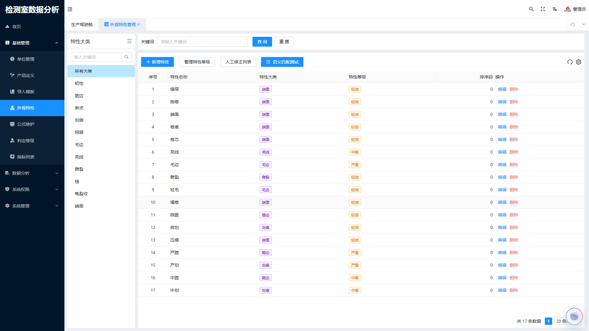

**界面布局**：
- 左侧：特性大类树形结构
- 中间：特性定义表格
- 右侧：语义匹配测试面板（可收起）

**操作步骤**：

1. 进入【基础管理】→【外观特性管理】

2. **新增特性**：
   - 点击【新增特性】按钮
   
   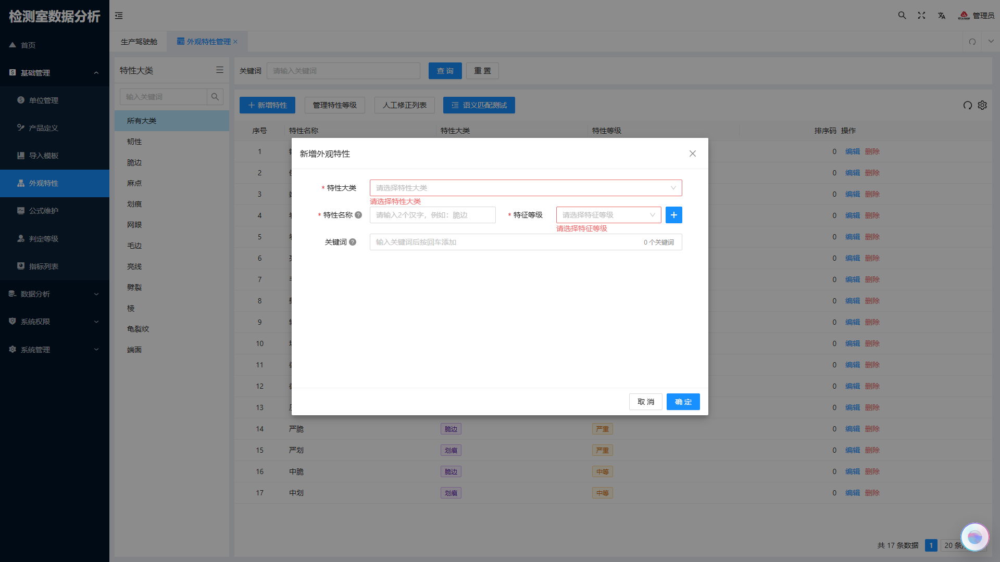
   
   - 填写特性名称
   - 选择所属大类
   - 选择特性等级
   - 添加匹配关键词（用于AI匹配）
   - 点击【确定】保存

3. **编辑特性**：
   - 在表格中找到目标特性
   - 点击【编辑】按钮修改

4. **删除特性**：
   - 点击【删除】按钮确认删除

5. **语义匹配测试**：
   - 点击右侧【语义匹配测试】按钮展开测试面板
   
   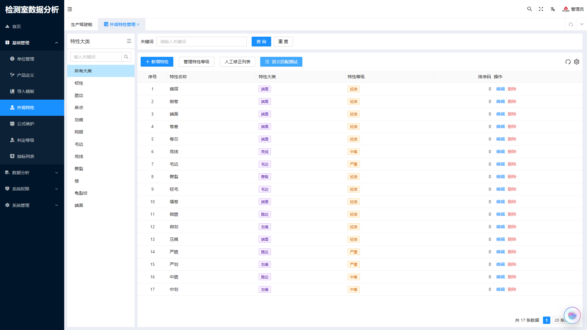
   
   - 在输入框中输入测试文本（如炉号后缀或备注信息）
   - 点击【规则 + AI 匹配】按钮
   - 查看匹配结果和匹配方式

**匹配方式说明**：
- **特性名称精确匹配**：输入文本与特性名称完全一致
- **关键词匹配**：输入文本包含特性的关键词
- **AI分析**：通过AI模型分析文本语义进行匹配

**人工修正**：
- 当匹配结果不确定时，系统会显示AI识别结果和建议
- 点击【确认添加到关键词】可将匹配文本添加为特性关键词
- 点击【人工修正匹配列表】查看所有待修正记录

---

### 3.6 公共维度管理

**功能说明**：管理公共维度信息，用于计算时引用，支持版本管理确保计算精度。

**操作步骤**：

1. 进入【基础管理】→【公共维度管理】

2. **新增公共维度**：
   - 点击【新增公共维度】按钮
   
   
   
   - 填写维度名称
   - 填写维度键名（英文标识，用于公式引用）
   - 选择值类型（小数/整数/文本）
   - 填写单位（可选）
   - 设置精度（小数位数）
   - 填写当前值
   - 点击【确定】保存

3. **编辑公共维度**：
   - 点击卡片上的【编辑】按钮
   - 修改相关信息

4. **版本管理**：
   - 点击【版本】按钮查看历史版本
   
   
   
   - 可以切换当前生效的版本
   - 可以创建新版本

5. **删除**：
   - 点击【删除】按钮确认删除

**注意事项**：
- 维度键名用于在公式中引用该维度
- 修改维度值时会自动创建新版本
- 可在中间数据公式中引用公共维度

---

### 3.7 公式维护

**功能说明**：维护中间数据表中的计算公式，支持从多个数据源引用变量。

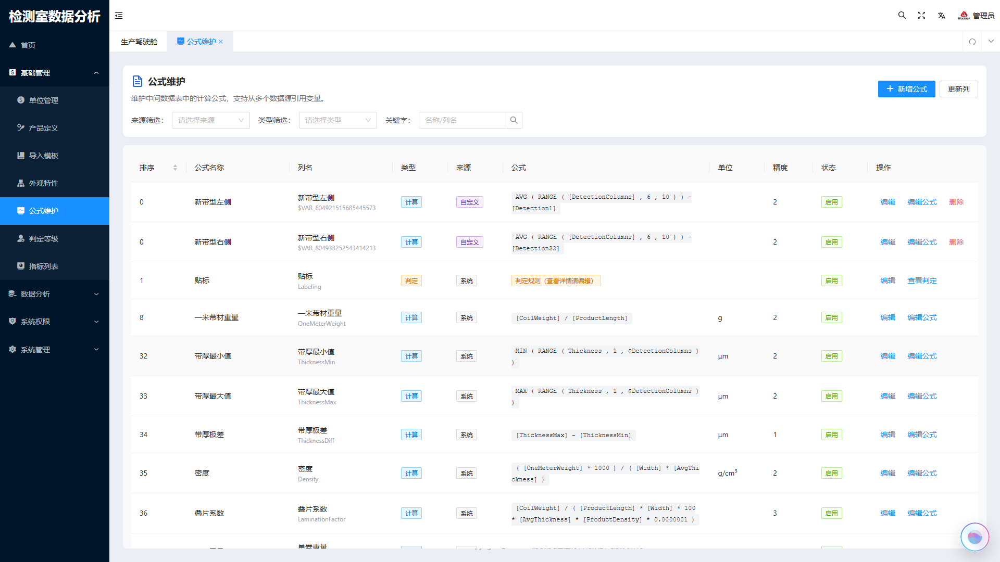

**公式类型**：
- **计算型（CALC）**：通过公式计算得出结果
- **判定型（JUDGE）**：根据条件判定等级
- **只展示（NO）**：仅展示原始值，不计算

**操作步骤**：

1. 进入【基础管理】→【公式维护】

2. **筛选公式**：
   - 使用"来源筛选"过滤系统默认/自定义公式
   - 使用"类型筛选"过滤计算/判定/只展示类型
   - 使用关键字搜索公式名称或列名

3. **新增公式**：
   - 点击【新增公式】按钮
   
   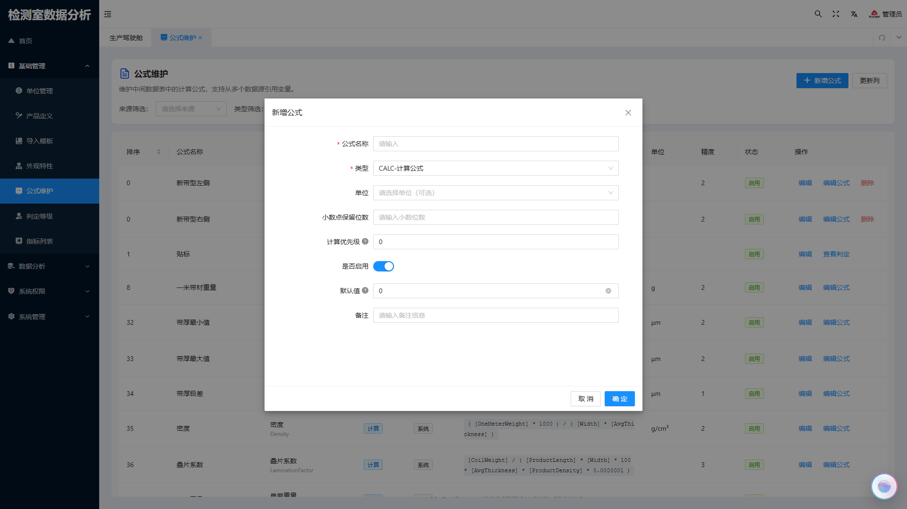
   
   - 填写公式名称
   - 选择公式类型
   - 选择数据来源
   - 配置公式表达式或判定规则
   - 设置单位和精度
   - 点击【确定】保存

4. **编辑公式属性**：
   - 点击【编辑】按钮
   - 修改显示名称、单位、精度等属性

5. **编辑公式表达式**：
   - 点击【编辑公式】按钮
   
   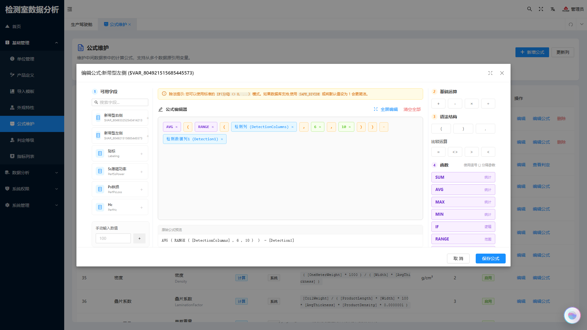
   
   - 在公式构建器中配置计算表达式
   - 支持引用其他列、公共维度、常量
   - 点击【保存】应用公式

6. **查看判定规则**：
   - 对于判定型公式，点击【查看判定】
   - 查看各等级的判定条件

7. **删除公式**：
   - 仅自定义公式可删除
   - 系统默认公式无法删除

8. **更新列**：
   - 点击【更新列】按钮同步最新的数据列

**公式语法说明**：
- 列引用：`{columnName}` 或 `{列显示名}`
- 公共维度引用：`@dimensionKey`
- 数学运算：`+`、`-`、`*`、`/`、`^`
- 函数支持：`AVG()`、`MAX()`、`MIN()`、`SUM()`等

---

### 3.8 判定等级

**功能说明**：为判定型公式配置不同产品规格下的等级判定条件。

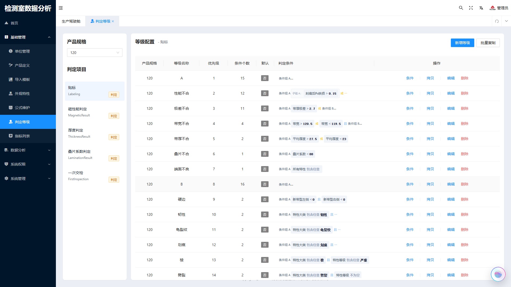

**界面布局**：
- 左侧：产品规格选择 + 判定项目列表
- 右侧：等级配置表格

**操作步骤**：

1. 进入【基础管理】→【判定等级】

2. **选择产品规格**：
   - 在左侧顶部选择产品规格
   - 如不选择则为通用配置

3. **选择判定项目**：
   - 在左侧列表中点击判定项目名称
   - 右侧显示该判定项目的等级配置

4. **新增等级**：
   - 点击【新增等级】按钮
   
   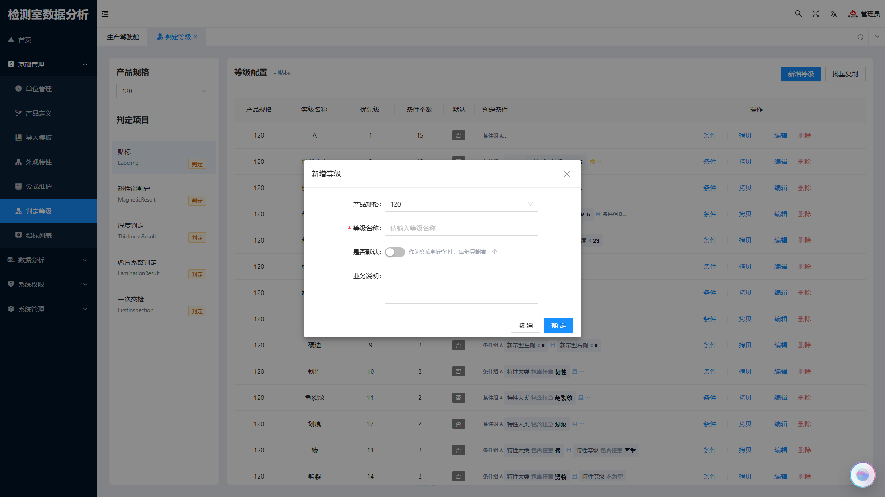
   
   - 填写等级名称
   - 设置优先级（数值越小优先级越高）
   - 选择质量状态（合格/不合格/其他）
   - 设置是否参与统计
   - 设置是否为默认等级
   - 选择颜色标识（可选）
   - 点击【确定】保存

5. **配置判定条件**：
   - 点击等级行的【条件】按钮
   
   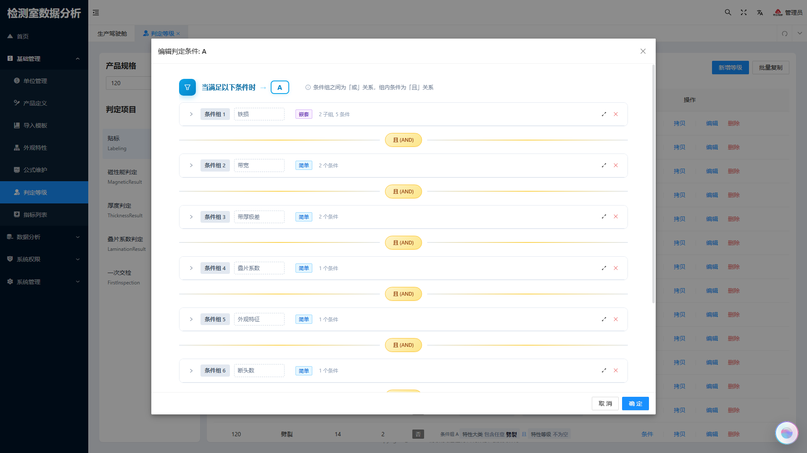
   
   - 在条件编辑器中配置判定规则
   - 支持多条件组合（且/或关系）
   - 条件可基于：列值、外观特性、特性等级等
   - 点击【确定】保存条件

6. **拷贝等级**：
   - 点击【拷贝】按钮复制当前等级
   - 可修改后保存为新等级

7. **批量复制**：
   - 点击【批量复制】按钮
   
   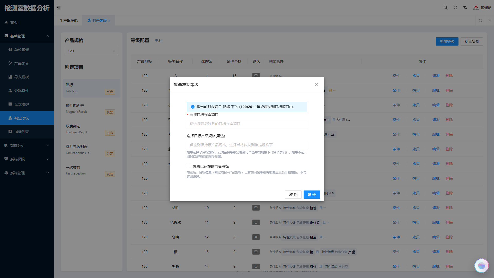
   
   - 选择源产品规格和目标产品规格
   - 一键复制所有等级配置

8. **删除等级**：
   - 点击【删除】按钮确认删除

9. **调整优先级**：
   - 拖动表格行调整等级优先级顺序
   - 优先级高的等级会先被匹配

**条件配置说明**：
- 支持条件组嵌套（组内可含子组）
- 条件类型：列值比较、特性存在、等级匹配等
- 比较运算符：等于、不等于、大于、小于、包含等

---

### 3.9 指标列表

**功能说明**：配置报表中需要统计展示的指标项。

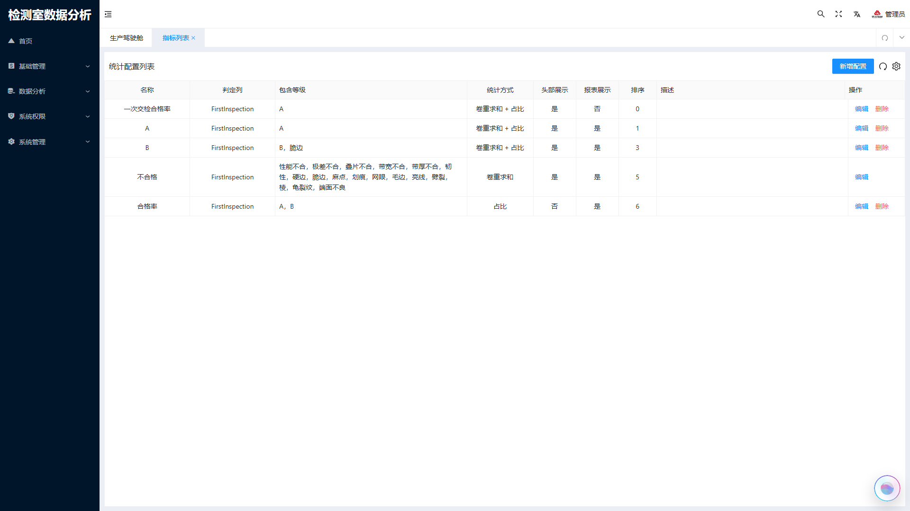

**操作步骤**：

1. 进入【基础管理】→【指标列表】

2. **新增配置**：
   - 点击【新增配置】按钮
   
   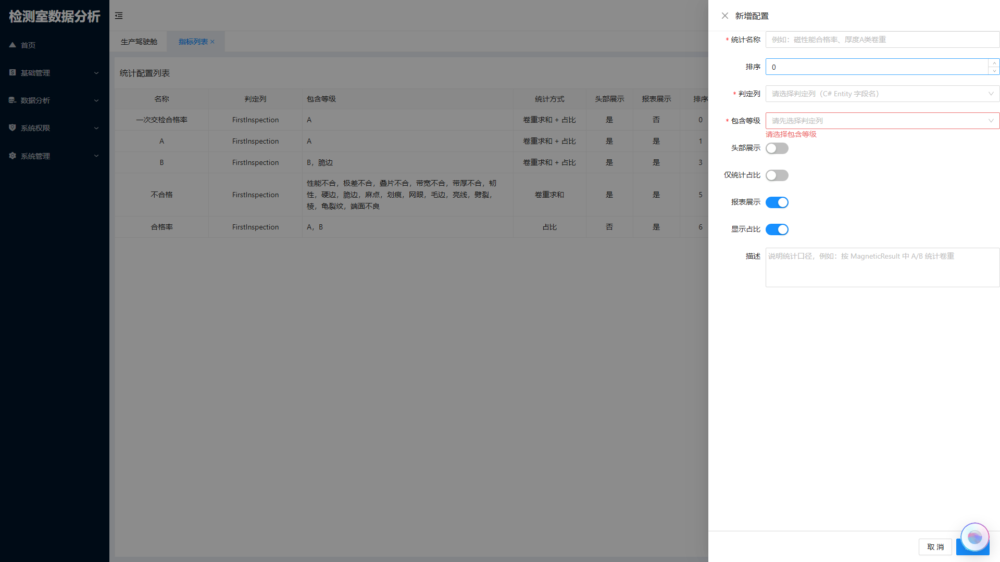
   
   - 填写指标名称
   - 选择关联的判定列
   - 选择包含的等级名称
   - 设置统计方式（重量汇总/占比/重量汇总+占比）
   - 设置是否在头部展示
   - 设置是否在报表中展示
   - 填写排序号
   - 点击【确定】保存

3. **编辑配置**：
   - 点击【编辑】按钮修改

4. **删除配置**：
   - 点击【删除】按钮确认删除
   - 系统配置不可删除

**注意事项**：
- 指标配置影响生产驾驶舱和月度报表的展示
- 头部展示的指标会在KPI卡片区显示
- 报表展示的指标会在图表中体现

---

### 3.10 Excel导入模板

**功能说明**：管理Excel数据导入模板，配置Excel列与系统字段的映射关系，支持自动匹配和数据验证。

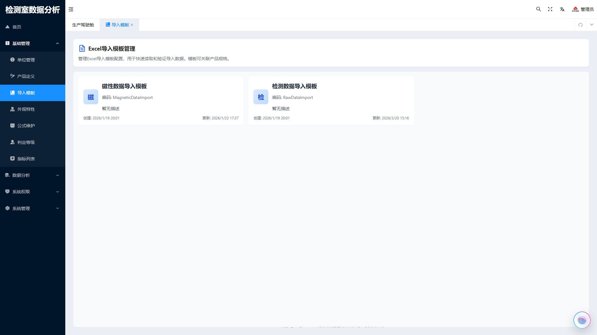

**界面说明**：
- 卡片式展示所有导入模板
- 显示模板名称、编码、描述、创建时间
- 支持编辑现有模板配置

**操作步骤**：

1. 进入【基础管理】→【Excel导入模板】

2. **查看模板列表**：
   - 系统预置了标准导入模板
   - 卡片显示模板基本信息
   - 悬停显示编辑按钮

3. **编辑模板**：
   - 点击模板卡片或【编辑】按钮
   
   
   
   **基本信息**：
   - 模板名称：显示模板的中文名称
   - 模板编码：系统自动生成的唯一标识
   
   **字段映射配置**：
   
   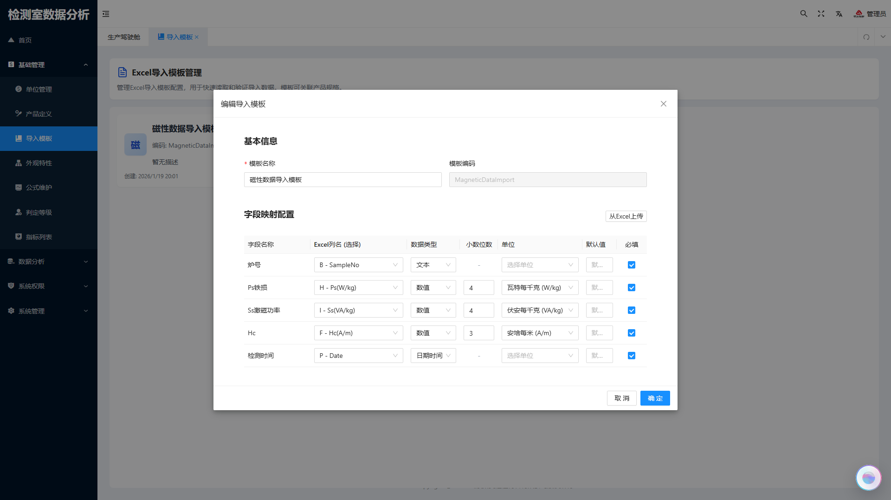
   
   表格列说明：
   | 列名 | 说明 |
   |------|------|
   | 字段名称 | 系统内部字段名（中文显示） |
   | Excel列名 | 选择Excel文件中的对应列 |
   | 数据类型 | 文本/数值/整数/日期时间 |
   | 小数位数 | 数值类型时设置保留位数 |
   | 单位 | 选择对应的计量单位 |
   | 默认值 | 当Excel单元格为空时使用的默认值 |
   | 必填 | 勾选后该字段必须有值 |

4. **从Excel上传配置**：
   - 点击【从Excel上传】按钮
   - 选择要导入的Excel文件
   - 系统自动解析Excel表头
   - 根据字段名自动匹配对应列
   - 显示匹配成功的字段数量

5. **手动调整映射**：
   - 在"Excel列名"下拉框中选择对应列
   - 设置数据类型（如数值型设置小数位数）
   - 选择计量单位
   - 设置默认值（可选）
   - 勾选必填项

6. **保存配置**：
   - 点击【确定】保存模板配置
   - 配置将用于后续的数据导入

**自动匹配规则**：
1. 完全匹配：字段名与Excel列名完全一致（不区分大小写）
2. 包含匹配：字段名包含Excel列名或反之
3. 历史匹配：使用已保存的列名进行匹配

**使用场景**：
- 不同客户提供的Excel格式不同时，创建对应的导入模板
- 标准Excel格式有变更时，更新模板配置
- 新增加工产线时，配置新的数据导入规则

---

## 四、数据管理

### 4.1 原始数据管理

**功能说明**：管理从Excel导入的原始检测数据，支持数据查看、导入和日志追踪。

**界面布局**：
- 检测数据：显示有效的检测数据（按炉号/卷号排序）
- 原始数据：按Excel顺序显示所有数据（含无效数据）
- 导入与日志：数据导入入口和导入历史

**操作步骤**：

1. 进入【数据管理】→【原始数据管理】

2. **查看检测数据**：
   - 默认显示"检测数据"页签
   - 表格显示：检测日期、炉号、产品规格、宽度、带材重量、22列检测值等
   - 使用搜索框按关键词筛选
   - 使用日期范围筛选检测日期或录入日期
   - 点击产品规格名称可查看规格详情

3. **查看原始数据**：
   - 切换到"原始数据"页签
   
   
   
   - 显示所有导入的数据，包括标记为无效的数据
   - 数据类型筛选：全部/有效数据/无效数据
   - 可查看每行的数据状态和错误信息

4. **数据导入**：
   - 切换到"导入与日志"页签
   
   
   
   - 点击【分步导入向导】卡片
   
   **步骤1：上传Excel文件**
   
   
   
   **步骤2：预览解析结果**
   
   > 注：此步骤需要实际操作选择Excel文件后截图
   
   
   
   **步骤3：选择产品规格**
   
   > 注：此步骤需要实际操作选择Excel文件后截图
   
   
   
   **步骤4：匹配外观特性**
   
   > 注：此步骤需要实际操作选择Excel文件后截图
   
   
   
   **步骤5：最终确认并导入**
   
   > 注：此步骤需要实际操作选择Excel文件后截图
   
   

5. **查看导入日志**：
   - 在"导入与日志"页签下方查看历史导入记录
   - 显示：文件名、导入时间、操作人、总行数、成功数、状态
   - 点击【下载】可下载原始导入文件

**数据排序**：
- 检测数据页签支持自定义排序
- 可配置多字段排序规则（生产日期、炉次号、卷号、分卷号、产线等）

---

### 4.2 中间数据管理

**功能说明**：管理经过计算和判定后的中间数据，是系统的核心数据管理模块。

**界面说明**：
- 顶部：产品规格切换标签页
- 表格区：显示详细的检测数据（80+列）
- 工具栏：查询条件、排序、填充颜色、批量操作

**操作步骤**：

1. 进入【数据管理】→【中间数据管理】

2. **切换产品规格**：
   - 点击顶部标签页切换不同产品规格
   - 表格列会根据产品规格的检测列数动态调整

3. **查询数据**：
   - 使用关键词搜索炉号、产线等
   - 按检测日期、生产日期筛选
   - 按计算状态筛选（全部/待算/已算）
   - 按判定状态筛选（全部/待判/已判）

4. **自定义排序**：
   - 点击【排序】按钮打开排序编辑器
   
   
   
   - 添加/删除排序字段
   - 设置升序/降序
   - 支持多字段组合排序

5. **单元格颜色标记**：
   - 在"填充颜色"区域选择颜色
   - 点击表格单元格即可标记颜色
   - 点击【清除】按钮进入清除模式，再点击单元格清除颜色
   - 点击【保存配置】保存所有颜色标记

6. **编辑数据**：
   - **性能数据**：双击单元格直接编辑，支持激磁功率、铁损、矫顽力等
   - **外观特性**：双击单元格打开特性选择对话框
   
   
   
   - **基础信息**：双击日期、班次等单元格直接编辑
   - 修改后自动保存

7. **批量操作**：
   - **勾选数据**：点击行首复选框选择多行
   - **批量计算**：点击【批量计算】按钮重新计算选中行的公式
   - **批量判定**：点击【批量判定】按钮执行判定逻辑
   - **批量删除**：点击【批量删除】按钮删除选中数据

8. **重新计算**：
   - 点击计算状态标签可触发单条数据重新计算
   - 计算失败时会显示错误提示

9. **重新判定**：
   - 点击判定状态标签可触发单条数据重新判定
   - 待判定状态的数据会标橙色

10. **查看计算日志**：
    - 点击【日志】按钮查看该行的计算历史
    
    
    
    - 显示：时间、公式名称、公式类型、错误类型、错误消息

11. **导出Excel**：
    - 点击【导出Excel】按钮
    
    
    
    - 选择导出范围：本月/本年/自定义
    - 确认日期范围后导出

**表格列说明**：
- **固定列**：检验日期、喷次、贴标、炉号（左侧固定）
- **性能区**：1.35T激磁功率、50Hz铁损、矫顽力、刻痕后性能
- **物理特性**：一米带重、带宽、带厚（多列）、叠片系数
- **外观缺陷**：外观特性、断头数、单卷重量
- **花纹区**：中Si、中B、左/中/右花纹（纹宽/纹距）
- **判定区**：磁性能判定、厚度判定、叠片系数判定
- **状态区**：计算状态、判定状态、日志（右侧固定）

---

### 4.3 磁性数据导入

**功能说明**：快速导入磁性性能数据文件。

**操作步骤**：

1. 在中间数据管理页面，点击【磁性数据导入】按钮
2. 选择磁性数据Excel文件
3. 系统自动解析并匹配炉号
4. 确认数据映射关系
5. 点击【导入】完成数据导入

**注意事项**：
- 磁性数据文件需包含炉号或卷号以便匹配
- 重复导入会更新已有数据
- 导入后需要重新计算相关公式

---

## 五、报表与分析

### 5.1 生产驾驶舱

**功能说明**：可视化展示生产质量和检测数据的关键指标。

**数据面板**：

1. **KPI指标卡**：
   
   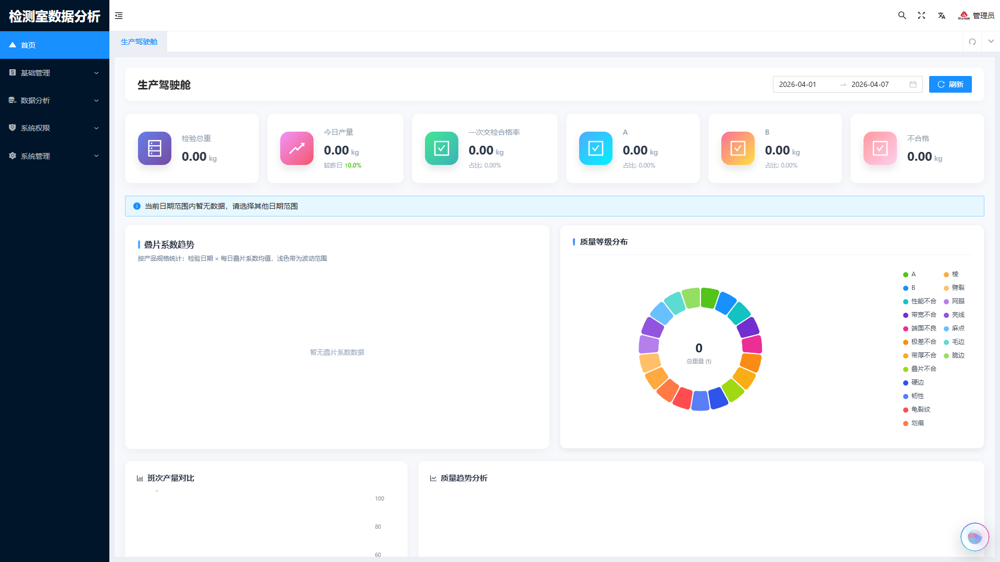
   
   - 总检测重量
   - 合格率
   - 叠片系数均值
   - 当日产量

2. **叠片系数趋势图**：
   
   
   
   - 折线图展示指定日期范围内的叠片系数变化
   - 显示均值线和置信区间
   - 鼠标悬停查看具体数值

3. **质量分布饼图**：
   
   
   
   - 展示各质量等级（A级、B级、不合格等）的占比
   - 点击扇区可下钻查看明细

4. **班次对比雷达图**：
   
   
   
   - 多维度对比各班次的质量表现
   - 维度包括：合格率、叠片系数、厚度合格率等

5. **不合格原因Top5**：
   
   
   
   - 柱状图展示主要不合格原因排名
   - 显示重量和占比

6. **厚度相关性散点图**：
   
   
   
   - 展示厚度与叠片系数的散点分布
   - 帮助分析两者的相关性

7. **班次对比柱状图**：
   
   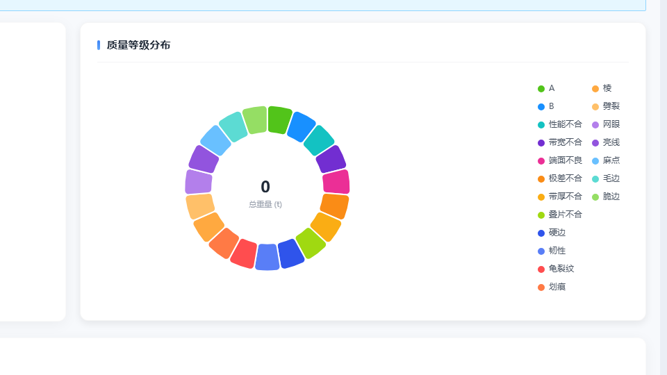
   
   - 对比各班次的产量和合格率

8. **质量趋势图**：
   
   
   
   - 展示合格率随时间的变化趋势

**操作说明**：
- 使用日期选择器切换统计范围
- 点击图表元素可下钻查看详细数据
- 点击【刷新】更新最新数据

---

## 六、常见问题

### Q1: 为什么导入的数据显示为"无效数据"？

**可能原因**：
- 炉号格式不正确
- 必填字段缺失
- 数据类型不匹配

**解决方法**：
- 在"原始数据"页签查看具体错误信息
- 修正Excel文件后重新导入

### Q2: 计算公式没有自动计算？

**可能原因**：
- 公式配置错误
- 引用的列值为空
- 公共维度未配置

**解决方法**：
- 检查公式配置是否正确
- 查看计算日志了解具体错误
- 确认引用的公共维度有值

### Q3: 外观特性匹配不准确？

**解决方法**：
- 在"外观特性管理"中完善关键词
- 使用语义匹配测试功能验证
- 在人工修正列表中修正匹配结果

### Q4: 如何修改产品规格的检测列数？

**操作步骤**：
1. 进入【产品规格定义】
2. 找到目标产品规格
3. 点击【编辑】
4. 修改"检测列数"
5. 保存后中间数据表格会自动调整

**注意**：修改检测列数后，已有数据可能需要重新导入

### Q5: 判定结果不符合预期？

**检查项**：
1. 确认判定等级的条件配置正确
2. 检查各等级的优先级顺序
3. 确认外观特性和等级已正确关联
4. 查看中间数据的贴标列是否有值

---

## 附录

### 快捷键列表

| 快捷键 | 功能 |
|--------|------|
| Ctrl + S | 保存当前编辑 |
| Ctrl + F | 打开搜索 |
| Ctrl + R | 刷新当前页面 |
| Esc | 关闭弹窗/取消编辑 |

### 术语表

| 术语 | 说明 |
|------|------|
| 叠片系数 | 带钢叠片后的紧密程度指标 |
| 激磁功率 | 磁性材料在交变磁场中的功率损耗 |
| 铁损 | 磁性材料在磁化过程中的能量损失 |
| 矫顽力 | 使磁性材料退磁所需的反向磁场强度 |
| 炉号 | 冶炼炉次的唯一标识 |
| 卷号 | 钢卷的唯一标识 |
| 分卷号 | 大卷分割后的小卷标识 |
| 喷次 | 喷涂工序的批次号 |

---

## 截图清单

本文档需要以下截图（存放于 `docs/screenshots/` 目录）：

### 系统级截图
- `01-系统界面概览.png` - 系统主界面，展示左侧菜单和右侧内容区
- `02-登录页面.png` - 系统登录界面
- `03-生产驾驶舱.png` - 首页数据仪表盘

### 基础管理截图（存放于 `基础管理/` 目录）

#### 产品规格定义
- `03-01-产品规格定义-列表页.png` - 产品规格卡片列表
- `03-02-产品规格定义-新增弹窗.png` - 新增/编辑产品规格弹窗

#### 单位管理
- `03-03-单位管理-单位维度.png` - 单位维度标签页
- `03-04-单位管理-新增维度弹窗.png` - 新增单位维度弹窗
- `03-05-单位管理-单位定义.png` - 单位定义标签页
- `03-06-单位管理-新增单位弹窗.png` - 新增单位定义弹窗

#### 特性等级管理
- `03-07-特性等级管理-列表页.png` - 特性等级卡片列表
- `03-08-特性等级管理-新增弹窗.png` - 新增特性等级弹窗

#### 外观特性大类管理
- `03-09-外观特性大类管理-列表页.png` - 外观特性大类表格
- `03-10-外观特性大类管理-新增弹窗.png` - 新增大类弹窗

#### 外观特性管理
- `03-11-外观特性管理-主界面.png` - 外观特性管理主界面（含左侧树、中间表格、右侧测试面板）
- `03-12-外观特性管理-新增弹窗.png` - 新增外观特性弹窗
- `03-13-外观特性管理-语义匹配测试.png` - 语义匹配测试面板

#### 公共维度管理
- `03-14-公共维度管理-列表页.png` - 公共维度卡片列表
- `03-15-公共维度管理-新增弹窗.png` - 新增公共维度弹窗
- `03-16-公共维度管理-版本管理.png` - 版本管理弹窗

#### 公式维护
- `03-17-公式维护-主界面.png` - 公式维护表格界面
- `03-18-公式维护-新增弹窗.png` - 新增公式弹窗
- `03-19-公式维护-公式构建器.png` - 公式构建器弹窗

#### 判定等级
- `03-20-判定等级-主界面.png` - 判定等级主界面（左侧面板+右侧表格）
- `03-21-判定等级-新增弹窗.png` - 新增等级弹窗
- `03-22-判定等级-条件编辑器.png` - 条件编辑器弹窗
- `03-23-判定等级-批量复制弹窗.png` - 批量复制弹窗

#### 指标列表
- `03-24-指标列表-主界面.png` - 指标列表表格
- `03-25-指标列表-新增弹窗.png` - 新增指标配置弹窗

### 数据管理截图（存放于 `数据管理/` 目录）

#### 原始数据管理
- `04-01-原始数据管理-检测数据.png` - 检测数据页签
- `04-02-原始数据管理-原始数据.png` - 原始数据页签
- `04-03-原始数据管理-导入与日志.png` - 导入与日志页签
- `04-04-原始数据管理-导入步骤1.png` - 分步导入向导-步骤1（上传文件）
- `04-05-原始数据管理-导入步骤2.png` - 分步导入向导-步骤2（预览数据）
- `04-06-原始数据管理-导入步骤3.png` - 分步导入向导-步骤3（选择产品规格）
- `04-07-原始数据管理-导入步骤4.png` - 分步导入向导-步骤4（匹配外观特性）
- `04-08-原始数据管理-导入步骤5.png` - 分步导入向导-步骤5（确认导入）

#### 中间数据管理
- `04-09-中间数据管理-主界面.png` - 中间数据管理主界面（含表格和工具栏）
- `04-10-中间数据管理-排序编辑器.png` - 自定义排序编辑器
- `04-11-中间数据管理-特性选择弹窗.png` - 外观特性选择弹窗
- `04-12-中间数据管理-计算日志.png` - 计算日志抽屉
- `04-13-中间数据管理-导出弹窗.png` - 导出日期选择弹窗

#### 磁性数据导入
- `04-14-磁性数据导入-弹窗.png` - 磁性数据导入弹窗

### 报表分析截图（存放于 `报表分析/` 目录）

#### 生产驾驶舱
- `05-01-生产驾驶舱-完整界面.png` - 生产驾驶舱完整界面
- `05-02-生产驾驶舱-KPI指标卡.png` - KPI指标卡区域
- `05-03-生产驾驶舱-叠片系数趋势.png` - 叠片系数趋势图
- `05-04-生产驾驶舱-质量分布饼图.png` - 质量分布饼图
- `05-05-生产驾驶舱-班次对比雷达图.png` - 班次对比雷达图
- `05-06-生产驾驶舱-不合格原因Top5.png` - 不合格原因Top5柱状图
- `05-07-生产驾驶舱-厚度相关性散点图.png` - 厚度相关性散点图
- `05-08-生产驾驶舱-班次对比柱状图.png` - 班次对比柱状图
- `05-09-生产驾驶舱-质量趋势图.png` - 质量趋势图

---

**文档结束**
