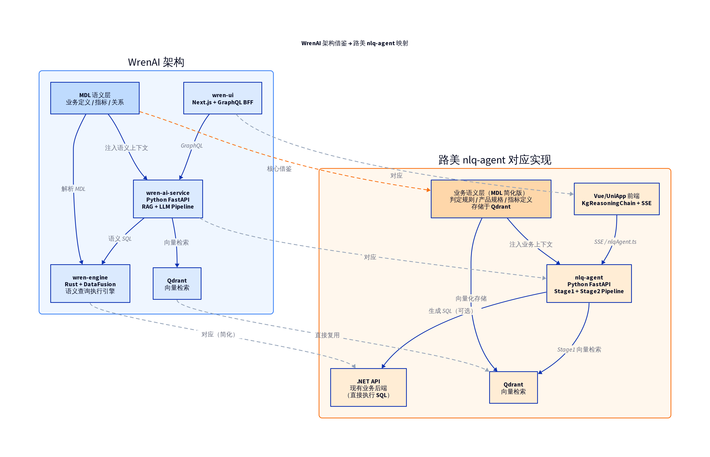
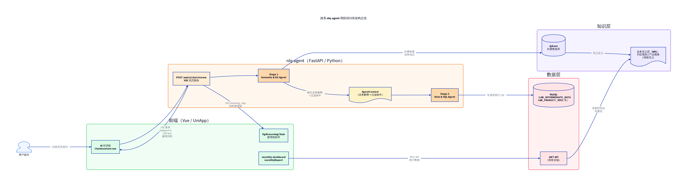
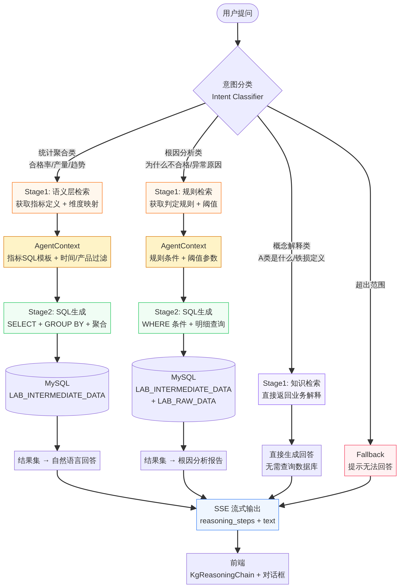
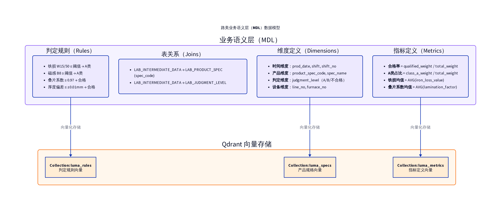
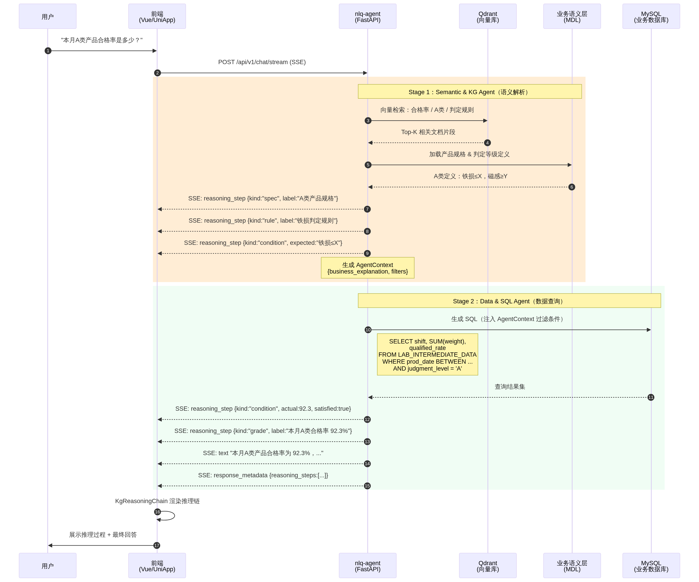

# nlq-agent 完整开发方案

> **版本**: v1.0 | **日期**: 2026-04-29 | **作者**: Manus AI
>
> 本文档是路美实验室"知识图谱 → 数据查询"两阶段问答系统的**完整可开发方案**，包含架构设计、核心代码说明、部署配置和实施路线图。所有代码文件已就绪于 `nlq-agent/` 目录中。

---

## 1. 架构核心思想与知识图谱的价值

### 1.1 知识图谱（语义层）的不可替代性

用户的统计问题看似简单（如"本月合格率是多少？"），但 LLM 直接面对数据库 DDL 时，并不知道什么是"合格率"、什么是"A 类产品"。WrenAI 项目（GitHub 15k+ Star）的核心设计理念正是**语义层（Semantic Layer / MDL）** [1]——在生成 SQL 之前，必须先让 LLM "懂业务"。

在路美项目中，知识图谱存储的正是这些业务定义：

| 语义组件 | 存储内容 | 示例 | Qdrant Collection |
| :--- | :--- | :--- | :--- |
| **判定规则** | A/B/不合格的阈值条件 | 铁损 ≤ 0.80 W/kg → A类 | `luma_rules` |
| **产品规格** | 各牌号的参数标准 | 120 规格：标准厚度 0.23mm | `luma_specs` |
| **指标定义** | 统计指标的计算公式 | 合格率 = 三项全合格数/总数 | `luma_metrics` |

### 1.2 WrenAI 架构映射



WrenAI 的三层 Pipeline（Indexing → Retrieval → Generation）被完美映射到路美的两阶段架构中。WrenAI 的 `sql_correction.py` 修正循环机制也被引入到 Stage 2，当 SQL 执行失败时自动将错误信息喂给 LLM 进行修正重试。

---

## 2. 两阶段问答架构总览



整个系统由一个 FastAPI 微服务（`nlq-agent`）承载，内部串联两个 Agent：

**Stage 1（Semantic & KG Agent）** 负责"先懂业务"：接收用户问题 → 意图分类 → Qdrant 向量检索 → 语义解析，输出 `AgentContext`（包含业务解释、过滤条件、指标定义）。

**Stage 2（Data & SQL Agent）** 负责"再查数据"：接收 `AgentContext` → SQL 生成 → 安全执行 → 条件回填 → 最终回答生成。

两个阶段通过 `AgentContext` 数据结构桥接，通过 SSE 事件流实时推送推理步骤到前端 `<KgReasoningChain>` 组件。

---

## 3. 统计问题的智能路由



分析了 `monthly-dashboard` 和 `monthlyReport` 的前端代码后，归纳出用户的三类典型问题：

| 意图类型 | 典型问题 | Stage 1 行为 | Stage 2 行为 |
| :--- | :--- | :--- | :--- |
| **statistical** | 本月合格率/各班次产量对比 | 检索指标定义和维度映射 | 生成 GROUP BY 聚合 SQL |
| **root_cause** | 为什么昨天合格率低/哪些炉号超标 | 检索判定规则和阈值 | 生成明细查询 SQL |
| **conceptual** | A类是什么/铁损定义 | 直接返回知识 | **跳过**（不需要查数据） |
| **out_of_scope** | 天气怎么样 | — | 返回"超出范围"提示 |

路由逻辑实现在 `src/pipelines/orchestrator.py` 的 `stream_chat()` 方法中。

---

## 4. 语义层数据模型



语义层的初始化由 `scripts/init_semantic_layer.py` 完成。该脚本从 MySQL 中读取判定规则（`LAB_INTERMEDIATE_DATA_JUDGMENT_LEVEL`）、产品规格（`LAB_PRODUCT_SPEC` + `LAB_PRODUCT_SPEC_ATTRIBUTE`）和公式定义（`LAB_INTERMEDIATE_DATA_FORMULA`），格式化为自然语言文本后向量化写入 Qdrant。此外，还包含 5 个手动维护的预定义指标（合格率、产量、铁损、叠片系数、平均厚度）。

---

## 5. 前端集成与 SSE 协议

### 5.1 零改动前端集成

本架构的一个重大优势是**完全兼容现有前端组件**。`web/src/api/nlqAgent.ts` 和 `mobile/utils/sse-client.js` 无需任何修改。SSE 协议严格遵循前端已定义的回调接口：

| SSE 事件类型 | 前端回调 | 触发阶段 |
| :--- | :--- | :--- |
| `reasoning_step` | `onReasoningStep(step)` | Stage 1 + Stage 2 |
| `text` | `onText(chunk)` | Stage 2 |
| `response_metadata` | `onResponseMetadata(payload)` | Stage 2 结束 |
| `error` | `onError(msg)` | 任意阶段 |
| `done` | `onDone()` | 最终 |

### 5.2 condition 步骤的两阶段填充

这是架构中最精巧的设计之一。以用户问"铁损是否达标？"为例：

**Stage 1 发射**（只有 expected，无 actual）：
```json
{"kind": "condition", "label": "铁损阈值", "field": "F_PERF_PS_LOSS", "expected": "<= 0.80"}
```

**Stage 2 回填**（查询后补充 actual 和 satisfied）：
```json
{"kind": "condition", "label": "铁损阈值", "field": "F_PERF_PS_LOSS", "expected": "<= 0.80", "actual": 0.75, "satisfied": true}
```

前端 `<KgReasoningChain>` 会根据 `satisfied` 值渲染绿色"满足"或红色"不满足"标签。

### 5.3 完整交互时序



---

## 6. 项目目录结构与代码说明

```text
nlq-agent/
├── docker-compose.yml          # 服务编排（Agent + Qdrant + TEI）
├── Dockerfile                  # Agent 镜像构建
├── .env.example                # 环境变量模板
├── requirements.txt            # Python 依赖
├── pyproject.toml              # 项目配置
├── README.md                   # 项目 README
│
├── scripts/
│   └── init_semantic_layer.py  # 语义层初始化（MySQL → Qdrant）
│
├── tests/
│   └── test_pipeline.py        # 单元测试 + 集成测试
│
├── packages/
│   └── shared-types/
│       └── src/
│           └── reasoning-protocol.ts  # 与前端共享的类型定义（上游源）
│
└── src/
    ├── main.py                 # FastAPI 入口 + 生命周期管理
    │
    ├── api/                    # HTTP 层
    │   ├── routes.py           # 路由定义（/chat/stream, /health, /sync/*）
    │   └── dependencies.py     # 依赖注入（服务单例管理）
    │
    ├── core/
    │   └── settings.py         # Pydantic Settings（环境变量配置）
    │
    ├── models/
    │   ├── schemas.py          # 所有 Pydantic 数据模型
    │   └── ddl.py              # 数据库 DDL + 预定义 SQL 模板
    │
    ├── pipelines/              # 核心业务逻辑
    │   ├── orchestrator.py     # 主编排器（串联 Stage1 + Stage2）
    │   ├── stage1/
    │   │   └── semantic_kg_agent.py  # 语义解析与图谱检索
    │   └── stage2/
    │       └── data_sql_agent.py     # SQL 生成、执行与回答
    │
    ├── services/               # 基础设施服务
    │   ├── llm_client.py       # OpenAI-compatible LLM 客户端
    │   ├── embedding_client.py # TEI Embedding 客户端
    │   ├── qdrant_service.py   # Qdrant 向量检索
    │   ├── database.py         # MySQL 异步客户端（含 SQL 安全验证）
    │   └── sse_emitter.py      # SSE 事件格式化与发射
    │
    └── utils/
        └── prompts.py          # 所有 LLM Prompt 模板集中管理
```

### 6.1 核心模块职责速查

| 模块 | 文件 | 核心职责 | 代码行数 |
| :--- | :--- | :--- | :--- |
| **编排器** | `orchestrator.py` | 串联 Stage1/Stage2，根据意图路由 | ~150 行 |
| **Stage 1** | `semantic_kg_agent.py` | 意图分类 + Qdrant 检索 + 语义解析 | ~230 行 |
| **Stage 2** | `data_sql_agent.py` | SQL 生成 + 执行 + 修正 + 回答 | ~280 行 |
| **SSE 发射器** | `sse_emitter.py` | 格式化 SSE 事件，管理推理步骤 | ~120 行 |
| **数据库** | `database.py` | 安全 SQL 执行，连接池管理 | ~130 行 |
| **Qdrant** | `qdrant_service.py` | Collection 管理，语义检索 | ~160 行 |
| **DDL** | `ddl.py` | 表结构定义 + 预定义 SQL 模板 | ~250 行 |
| **Prompt** | `prompts.py` | 6 套 Prompt 模板 | ~200 行 |
| **数据模型** | `schemas.py` | 15 个 Pydantic 模型 | ~160 行 |
| **配置** | `settings.py` | 25+ 配置项 | ~80 行 |

---

## 7. 关键代码设计详解

### 7.1 AgentContext — 两阶段的数据桥梁

`AgentContext` 是 Stage 1 的输出、Stage 2 的输入，是整个架构中最重要的数据结构：

```python
class AgentContext(BaseModel):
    user_question: str                          # 用户原始问题
    intent: IntentClassification                # 意图分类结果
    business_explanation: str                    # 业务解释（来自知识图谱）
    filters: list[FilterCondition]              # 结构化过滤条件
    metrics: list[MetricDefinition]             # 指标定义
    retrieved_documents: list[dict[str, Any]]   # 原始检索文档
    reasoning_steps: list[ReasoningStep]        # 已发射的推理步骤
```

Stage 1 填充 `business_explanation`、`filters`、`metrics`，Stage 2 基于这些信息生成 SQL。这种设计确保了 LLM 在生成 SQL 时拥有充分的业务上下文。

### 7.2 SQL 安全机制

`database.py` 实现了三层安全防护：

1. **正则白名单**：只允许 `SELECT` 开头的语句，拦截所有 `INSERT/UPDATE/DELETE/DROP/ALTER` 等写操作。
2. **自动 LIMIT**：如果 SQL 中没有 `LIMIT` 子句，自动追加 `LIMIT 501`（超过 500 行截断）。
3. **数据库只读账号**：`.env` 中配置的 `MYSQL_USER` 应使用只读权限的数据库账号。

### 7.3 SQL 修正循环（借鉴 WrenAI）

当 SQL 执行失败时，Stage 2 会自动进入修正循环（最多 2 次）：

```
SQL 生成 → 执行 → 失败？
                    ↓ 是
              将原始 SQL + 错误信息 + DDL 喂给 LLM
                    ↓
              LLM 输出修正后的 SQL
                    ↓
              重新执行 → 再次失败？→ 再修正一次
                                        ↓
                                   最终失败 → fallback
```

### 7.4 Prompt 模板管理

所有 Prompt 集中在 `utils/prompts.py` 中，共 6 套模板：

| Prompt | 用途 | 调用位置 |
| :--- | :--- | :--- |
| `INTENT_CLASSIFICATION_*` | 意图分类 | Stage 1 |
| `STAGE1_SEMANTIC_*` | 语义解析（提取条件和指标） | Stage 1 |
| `STAGE2_SQL_GENERATION_*` | SQL 生成 | Stage 2 |
| `STAGE2_SQL_CORRECTION_*` | SQL 修正 | Stage 2（失败时） |
| `FINAL_ANSWER_*` | 最终回答生成 | Stage 2 |
| `CONCEPTUAL_ANSWER_*` | 概念解释（跳过 Stage 2） | 编排器 |

### 7.5 预定义 SQL 模板

`ddl.py` 中的 `METRIC_SQL_TEMPLATES` 为高频统计问题提供了预定义的 SQL 模板。当 Stage 1 识别出用户问的是"合格率"或"产量"时，Stage 2 会优先使用这些模板，而非完全依赖 LLM 从零生成 SQL。这显著提升了高频查询的准确率和响应速度。

目前已预定义 4 个模板：合格率、产量统计、铁损均值、叠片系数统计。

---

## 8. 部署与运维

### 8.1 Docker Compose 一键部署

```bash
# 1. 配置环境变量
cp .env.example .env
vim .env  # 填入 LLM_API_KEY, MYSQL_PASSWORD 等

# 2. 启动基础设施
docker compose up -d qdrant tei

# 3. 初始化语义层
pip install -r requirements.txt
python scripts/init_semantic_layer.py

# 4. 启动 Agent
docker compose up -d nlq-agent
```

### 8.2 服务端口规划

| 服务 | 端口 | 说明 |
| :--- | :--- | :--- |
| nlq-agent | 18100 | FastAPI 问答微服务 |
| Qdrant REST | 6333 | 向量数据库 REST API |
| Qdrant gRPC | 6334 | 向量数据库 gRPC |
| TEI | 8001 | Embedding 服务 |
| vLLM | 8000 | LLM 推理（可选，可用外部服务） |

### 8.3 .NET 后端集成

在 .NET 后端的判定规则或产品规格 CRUD 操作中，添加 HTTP 回调：

```csharp
// 在规则保存后触发同步
await _httpClient.PostAsJsonAsync(
    $"{nlqAgentUrl}/api/v1/sync/rules",
    new { action = "upsert", data = changedRules }
);
```

### 8.4 健康检查

```bash
curl http://localhost:18100/health
# 响应：
# {"status":"ok","version":"0.1.0","qdrant_connected":true,"mysql_connected":true,"llm_available":true}
```

---

## 9. 实施路线图

| 阶段 | 工作内容 | 预估工时 | 前置依赖 |
| :--- | :--- | :--- | :--- |
| **Phase 1** | 部署 Qdrant + TEI，运行语义层初始化脚本 | 1 天 | Docker 环境 |
| **Phase 2** | 开发 Stage 1（意图分类 + Qdrant 检索 + 语义解析） | 2-3 天 | Phase 1 |
| **Phase 3** | 开发 Stage 2（SQL 生成 + 执行 + 修正 + 回答） | 2-3 天 | Phase 2 |
| **Phase 4** | SSE 协议对接，与前端联调 | 1-2 天 | Phase 3 |
| **Phase 5** | .NET 后端同步 Hook + 端到端测试 | 1-2 天 | Phase 4 |
| **Phase 6** | Prompt 调优 + 预定义模板扩充 + 性能优化 | 持续 | Phase 5 |

---

## 10. 与现有代码库的集成点

本方案与路美项目现有代码库的集成点如下：

| 集成点 | 现有文件 | 改动说明 |
| :--- | :--- | :--- |
| 前端 SSE 客户端 | `web/src/api/nlqAgent.ts` | **无需改动**，协议完全兼容 |
| 前端推理链组件 | `web/src/components/KgReasoningChain/` | **无需改动** |
| 移动端 SSE 客户端 | `mobile/utils/sse-client.js` | **无需改动** |
| 移动端推理链组件 | `mobile/components/kg-reasoning-chain/` | **无需改动** |
| 类型定义 | `web/src/types/reasoning-protocol.d.ts` | **无需改动**（由 shared-types 同步） |
| .NET AI Controller | `api/src/modularity/ai/Poxiao.AI.Controller.cs` | 添加 nlq-agent 代理路由 |
| .NET 规则 Service | `api/src/modularity/lab/` 相关 Service | 添加变更后的 HTTP 回调 |
| Docker Compose | 项目根目录 `docker-compose.yml` | 添加 nlq-agent 服务定义 |
| 环境变量 | `.env.example` | 添加 NLQ_AGENT_URL 等配置 |

---

## References

[1] Canner/WrenAI. (2026). Open-source text-to-SQL and text-to-chart GenBI agent with a semantic layer. GitHub. https://github.com/Canner/WrenAI
